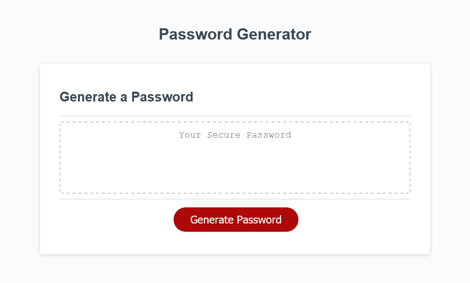

# password_generator
An client-based password generator.

This application is implemented in vanilla JavaScript.

Press the "Generate Password" button and answer the prompts about the conditions to apply when generating your password, and this app will create a password on-screen for you to use. 
 

The password generator is deployed [here](https://baker-ling.github.io/password_generator/index.html).

- Brian Baker
